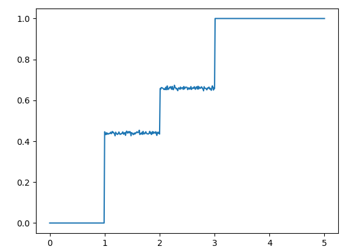
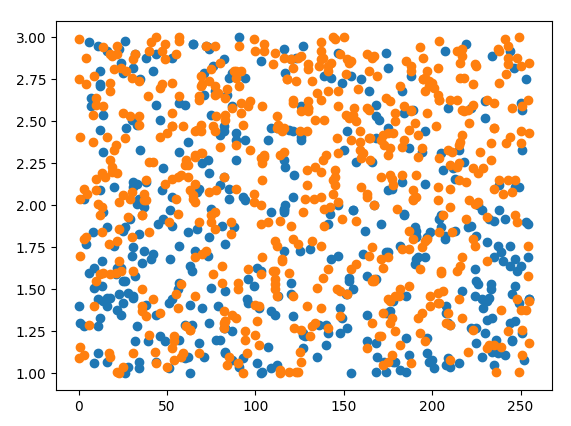
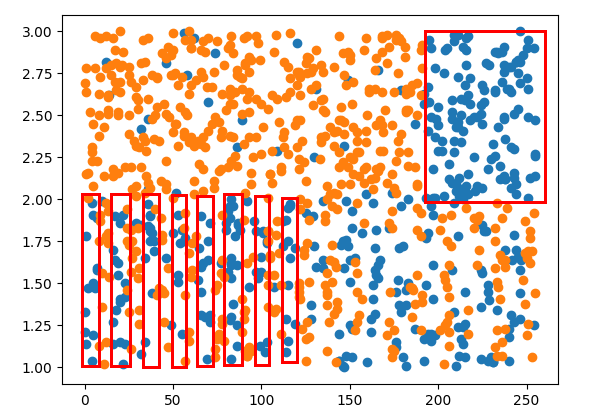
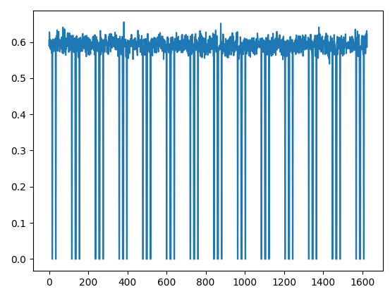

# Glitching AES
## Initial data
The provided glitching campaign results look like the following :
```
['plaintext:[ 39 249  70 194 226 136  58 125 177 143  48 239  64  93 131  84]', 'time: 0', 'power: 3.9', 'result: ', 'NO ANSWER']
['plaintext:[ 39 249  70 194 226 136  58 125 177 143  48 239  64  93 131  84]', 'time: 1', 'power: 1.53', 'result: ', [85, 230, 171, 32, 198, 36, 250, 207, 130, 251, 53, 53, 125, 242, 88, 143]]
['plaintext:[ 39 249  70 194 226 136  58 125 177 143  48 239  64  93 131  84]', 'time: 2', 'power: 4.03', 'result: ', 'NO ANSWER']
['plaintext:[ 39 249  70 194 226 136  58 125 177 143  48 239  64  93 131  84]', 'time: 3', 'power: 4.2', 'result: ', 'NO ANSWER']
['plaintext:[ 39 249  70 194 226 136  58 125 177 143  48 239  64  93 131  84]', 'time: 4', 'power: 0.41', 'result: ', [85, 230, 171, 32, 198, 36, 250, 207, 130, 251, 53, 53, 125, 242, 88, 143]]
['plaintext:[ 39 249  70 194 226 136  58 125 177 143  48 239  64  93 131  84]', 'time: 5', 'power: 0.63', 'result: ', [85, 230, 171, 32, 198, 36, 250, 207, 130, 251, 53, 53, 125, 242, 88, 143]]
...
```

In the provided data, 2560 plaintexts were attacked. For each one, 1625 glitches were made at different timing in the algorithm. The power of each glitch was given, and as output, the resulting ciphertext or lack thereof.

It was worth noting that for each plaintext, either the correct ciphertext or no output was given : no faulty ciphertext was ever returned by the board, which implied that fault detection was in place.

## Data conversion
First, let's convert the data in a more numpy-friendly format :
```python
def convert():
    i = 0
    with open("./campaign_results.txt") as f:
        plaintexts = list()
        ciphertexts = list()
        values = list()
        pt_txt_prev = ""
        i = 0
        for line in f:
            print(str(i*100//(2560*1625)).zfill(3)+"%", end='\r')
            i+=1
            pt_txt, time_txt, power_txt, _, result = eval(line)
            if pt_txt != pt_txt_prev:
                pt_txt_prev = pt_txt
                pt_arr = pt_txt.split("[")[1].split("]")[0].strip().split(" ")
                pt = [int(s) for s in pt_arr if s != ""]
                plaintexts.append(pt)
                values.append(list())
            power = float(power_txt.split(": ")[1])
            success = result != 'NO ANSWER'
            if success:
                ct = result
                if len(ciphertexts) == len(plaintexts):
                    assert ct == ciphertexts[-1]
                else:
                    ciphertexts.append(ct)
            values[-1].append((success, power))
    np.save("plaintexts.npy", np.array(plaintexts))
    np.save("ciphertexts.npy", np.array(ciphertexts))
    np.save("values.npy", np.array(values, dtype=[("success", np.bool), ("power", np.float32)]))
```
This will allow to load data nearly instantly instead of re-parsing the TXT file each  time, with the following :

```python
plaintexts, values, ciphertexts = load_data()
power = values["power"]
success = values["success"]
```

## Looking for patterns
First, let's look at the data to search for correlations between the glitches' power and the effect ("crash" or "no crash").
```python
from matplotlib import pyplot as plt
power_flat = power.flatten()
success_flat = success.flatten()
distinct_power = sorted(set(power_flat))
crash_proba_by_power = [1 - success_flat[power.flatten() == p].mean() for p in distinct_power]
plt.plot(distinct_power, crash_proba_by_power)
plt.show()
```


It seems that :
* Glitches with power under 1.0 never result in a crash, independently of time or manipulated data
* Glitches with power over 3.0 always result in a crash, independently of time or manipulated data
* Glitches with power between 1.0 and 2.0, or between 2.0 and 3.0 result sometimes in a crash, depending on time and manipulated data, but with different probabilities for each interval.

For the last two intervals, this could mean that the fault generated by the glitch fixes some bits in the manipulated data (at a given time), and thus a crash occurs if the bits affected by the glitch are modified (resp. the execution terminates normally if the bits are not modified by the glitch).

The effect of the fault can thus be modeled by an OR with 1, or an AND with 0 for some bits of the manipulated data (byte) at the time of the glitch.

## Looking for relations between manipulated data and crashes
In order to model more precisely the faults characteristics, we try to find the influence of the manipulated byte value on the probability a crash will occur at each time `t`. The following code filters out data points for which the glitch's power is over 3.0 or under 1.0, then for each `t` between 0 and 9 (arbitrary choice), a scatter plot is drawn representing the values of `plaintext[4]` (arbitrary choice) and glitch powers at which a crash occurs (orange dots) and at which a ciphertext is returned (blue dots).

```python
def search_non_uniform_distribution():
    power_between_1_and_3 = (1.0 <= power) & (power <= 3.0)
    power_between_1_and_3_t = power_between_1_and_3.transpose()
    success_t = success.transpose()
    power_t = power.transpose()
    plaintexts_byte4 = plaintexts.transpose()[4] # arbitrary : we look for the influence of plaintext[4] on crashes
    for t in range(10): #arbitrary : we assume plaintext[4] is used at the start
        glitch_power_success = power_t[t][success_t[t] & power_between_1_and_3_t[t]]
        involved_byte_success = plaintexts_byte4[success_t[t] & power_between_1_and_3_t[t]]
        glitch_power_crash = power_t[t][~success_t[t] & power_between_1_and_3_t[t]]
        involved_byte_crash = plaintexts_byte4[~success_t[t] & power_between_1_and_3_t[t]]
        plt.scatter(involved_byte_success, glitch_power_success)
        plt.scatter(involved_byte_crash, glitch_power_crash)
        plt.show()
```

The firsts graphs look like uniform random distributions :


However, for `t=4`, two pattern appear for glitch power in `[1.0;2.0]` and `[2.0;3.0]`.



The upper right pattern seems to indicate that if `plaintext[4] & 0b11000000 == 0b11000000`, no crash occurs if the glitch's power is between 2.0 and 3.0. So the glitch sets the two most significant bits of `plaintext[4]` nearly-deterministically.

Symmetrically the lower patterns indicate that if `plaintext[4] & 0b00001000 == 0b00000000`, no crash occurs if the glitch's power is between 1.0 and 2.0. So the glitch resets the fourth least significant bit of `plaintext[4]` nearly-deterministically.


## Identify the version of AES and useless data points
In order to extract the key bytes, we have to identify the targeted version of AES (128 / 192 / 256). Plotting the crash probability for each `t` value gives a pretty good insight :



The graph shows a series of 14 patterns, which probably correspond to the 14 rounds of AES 256. Moreover, we see that for some values of `t`, the crash probability (for a glitch power between 1.0 and 3.0) is 0 so it does not depend on the manipulated values at these moments.

```python
def get_irrelevant_times_for_crashes():
    power_is_between_1_and_3 = (power <= 3.0) & (1.0 <= power)
    crash_proba =  np.sum(~success, axis=0, where=power_is_between_1_and_3) / np.sum(np.ones_like(success), axis=0, where=power_is_between_1_and_3)
    plt.plot(crash_proba)
    plt.show()
    irrelevant_times = np.append(np.where(crash_proba==0.0), np.where(crash_proba==1.0))
    return irrelevant_times
```

## Extracting the key
We need to extract the first two subkeys of the AES algorithm. The main ideas of the algorithm are :
* For each of the 16 subkey bytes, we make a guess between `0` and `255`
* Given our key guess `subkey[j]`, we compute `B = Sbox[subkey[j] ^ state[j]]`
* We know the effects of the faults from previous observations:
  * a glitch power between 1.0 and 2.0 fixes bit 3 of the manipulated byte
  * a glitch power between 2.0 and 3.0 fixes bits 6 and 7 of the manipulated byte
* For each `t`, we try every combinations for the bits fixed by the fault and if they already match byte `B`, we expect not to find a crash, assuming `B` is manipulated at time `t`.
* If this last assumption holds for most of the data points for a given `t`, we assume the value we guessed for `subkey[j]` was correct.

In order to "efficiently" brute-force all values of `t`, `j`, `Kguess`, bits `3`, `6` and `7` of `B` and `plaintexts`, we heavily rely on `numpy`'s' arrays vectored operations (so sorry in advance is the code is not entirely readable).


```python
def get_k0(irrelevant_t, K0_known=None):
    scores = list()
    ciphertexts_t = ciphertexts.transpose()
    plaintexts_t = plaintexts.transpose()
    if K0_known is not None:
        state_0 = list()
        for pt in plaintexts:
            state = pt
            state = xor(state, K0_known)
            state = [Sbox[x] for x in state]
            state = ShiftRows(state)
            state = MixColumns(state)
            state_0.append(state)
        states_t = np.array(state_0).transpose()
    else:
        states_t = plaintexts_t
    success_t = success.transpose()
    power_between_1_and_2 = (1.0 <= power) & (power <= 2.0)
    power_between_1_and_2_t = power_between_1_and_2.transpose()
    power_between_2_and_3 = (2.0 <= power) & (power <= 3.0)
    power_between_2_and_3_t = power_between_2_and_3.transpose()
    K0 = list()
    K0_scores = list()
    for j in range(16):
        best_Kg = -1
        best_Kg_score = 0.0
        for Kg in range(256):
            tested_byte = np.array([Sbox[pj ^ Kg] for pj in states_t[j]])
            for bits76,bit3 in product(range(4), range(2)):
                bits_76_match = (tested_byte & 0b11000000)==bits76<<6
                bit_3_match = (tested_byte & 0b00001000)==bit3<<3
                power_and_bits_76_match = power_between_2_and_3_t & bits_76_match
                non_crash_and_power_and_bits_76_match = power_and_bits_76_match & success_t
                power_and_bit_3_match = power_between_1_and_2_t & bit_3_match
                non_crash_and_power_and_bit_3_match = power_and_bit_3_match & success_t
                scores = non_crash_and_power_and_bits_76_match.sum(1) + non_crash_and_power_and_bit_3_match.sum(1)
                total = power_and_bits_76_match.sum(1) + power_and_bit_3_match.sum(1)
                for t in irrelevant_t:
                    scores[t] = 0
                Kg_score = np.max(scores / total)
                for t,s in enumerate(scores / total):
                    if s>0.9:
                        print("j={},Kg={},t={},s={}".format(j,Kg,t,s))
                if Kg_score > best_Kg_score:
                    best_Kg_score = Kg_score
                    best_Kg = Kg
                    if Kg_score == 1.0: #no need to continue searching, triggers the "break" bellow
                        break
            else:
                continue
            break #triggered if Kg_score == 1.0 found
        K0.append(best_Kg)
        print(K0)
    return K0
```

As you can observe, the second round key is computed using the internal state of AES after the first round (known if we know the first round key), instead of the plaintext itself.

Getting the flag is just a matter of chaining operations.

```python
plaintexts, values, ciphertexts = load_data(256) #actually, it works with only 256 sets of plaintexts/ciphertexts, not the whole 2560
power = values["power"]
success = values["success"]
duration = len(power[0])
nb_pt = len(plaintexts)

if __name__ == "__main__":
    irrelevant_t = get_irrelevant_times_for_crashes()
    k0 =get_k0(irrelevant_t)
    k1 =get_k0(irrelevant_t, k0)
    from Crypto.Cipher import AES
    key = bytes(k0+k1)
    ct = bytes.fromhex("2801dd800e7ae333258224d5cbfc5420ec72a12256bdff61814972c7f93948f8")
    aes = AES.new(key, AES.MODE_ECB)
    pt=aes.decrypt(ct)
    print(repr(pt))
```

```
$ python3 solve_glitching.py
j=0,Kg=75,t=18,s=1.0
[75]
j=1,Kg=89,t=19,s=1.0
[75, 89]
j=2,Kg=99,t=20,s=1.0
[75, 89, 99]
j=3,Kg=21,t=21,s=1.0
[75, 89, 99, 21]
...
[13, 200, 189, 132, 196, 29, 119, 157, 230, 207, 241, 199, 6, 222]
j=14,Kg=211,t=153,s=1.0
[13, 200, 189, 132, 196, 29, 119, 157, 230, 207, 241, 199, 6, 222, 211]
j=15,Kg=27,t=154,s=1.0
[13, 200, 189, 132, 196, 29, 119, 157, 230, 207, 241, 199, 6, 222, 211, 27]
b'CTF{F4aulTC0rrel4ti0n|S4f33RR0R}'
```
