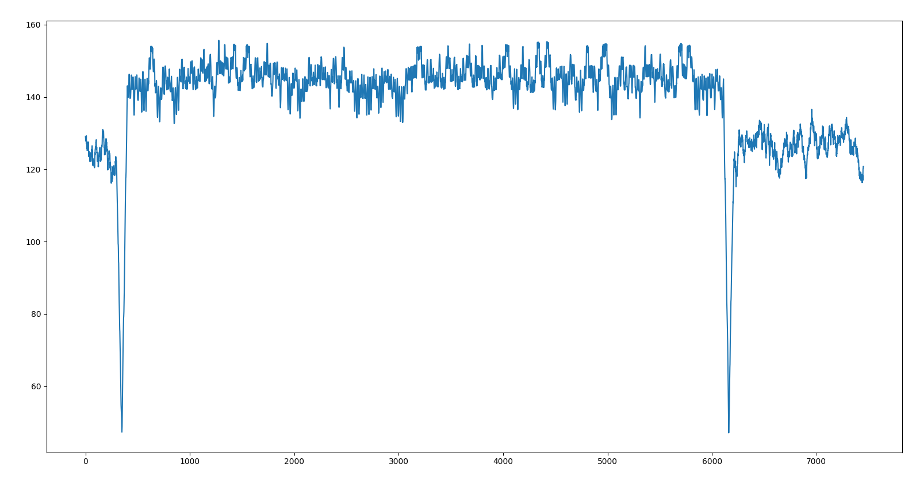
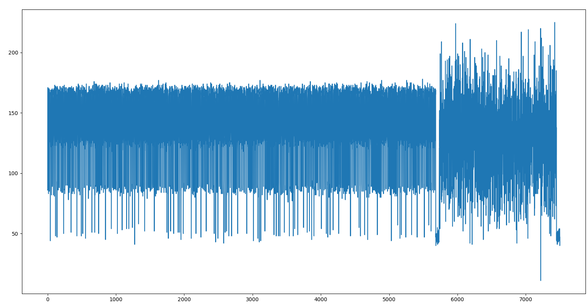
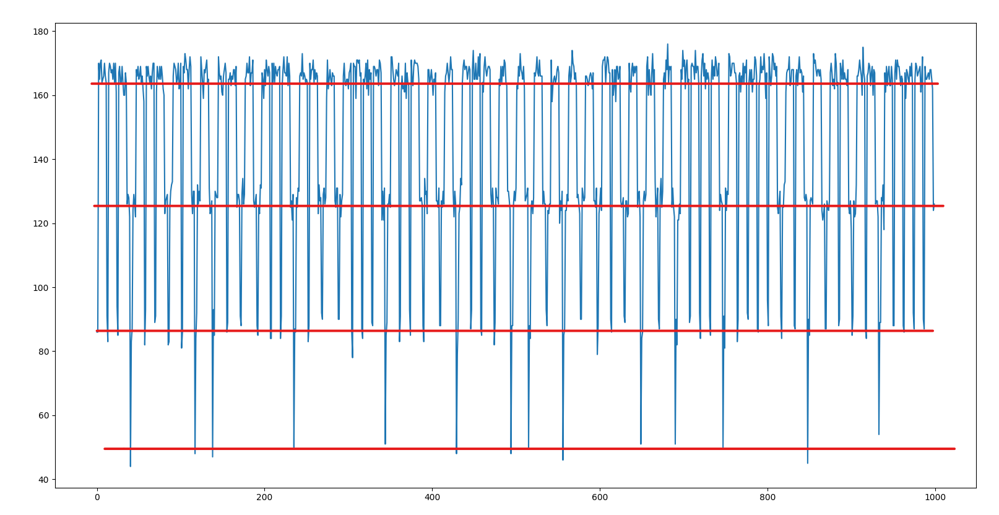
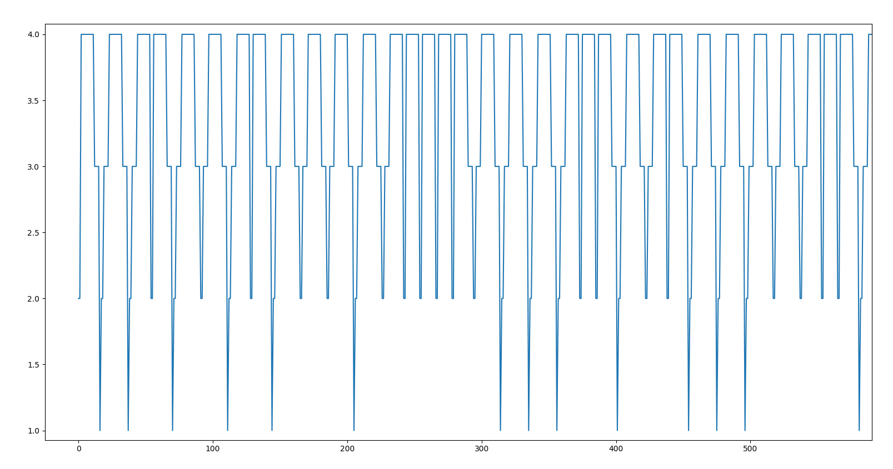
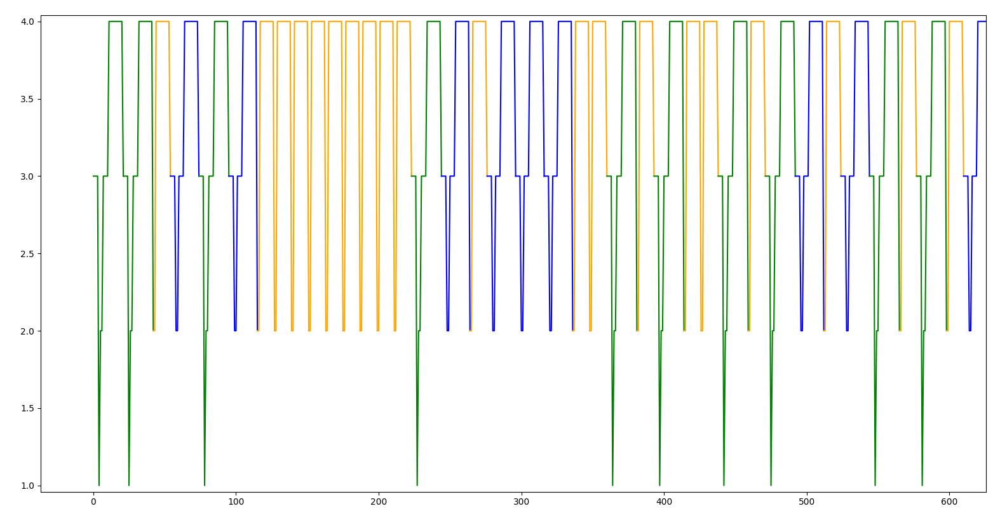
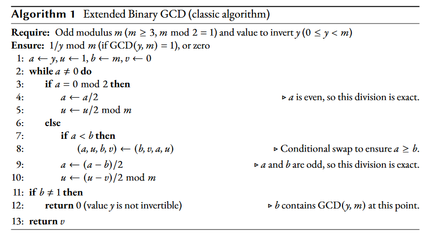
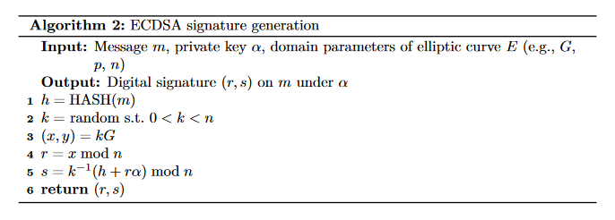
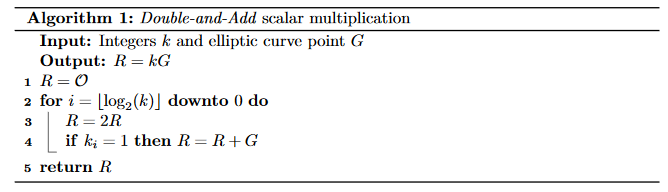

# Projective Signature (work in progress)

## Challenge
```
I'm spending a lot of time on this board that computes ECDSA signatures on secp256k1, with an unknown private key.

Using my favorite oscilloscope, I was able to capture what I think is the computation of this signature.

The public key, written in base 10 is ```(94443785317487831642935972645202783659685599642218408192269455854005741686810,
78142542704322095768523419012865788964201745299563420996262654666896320550926)```.

I was able to get a lot of signatures of the same message, and to record a power trace each time. Using signature verification, I was able to also retrieve the resulting curve point P each time.

The scalar multiplication algorithm is probably performed left to right, bit by bit, as a sequence of double and add operations.

My reasonable assumption is that the developers used the usual formulas: [point addition](https://www.hyperelliptic.org/EFD/g1p/auto-shortw-jacobian.html#addition-add-2007-bl) and [point doubling](https://www.hyperelliptic.org/EFD/g1p/auto-shortw-jacobian.html#doubling-dbl-2007-bl)

After some time analyzing the traces, I have come to the conclusion that the implementation is really well protected, as I couldn't find any meaningful signal relative to these operations.

However, a small window of several thousands of points seems to be exploitable. This leakage occurs right after the numerous similar patterns of the scalar multiplication, and they should hence correspond to the conversion of the point from a projective coordinates representation to an affine coordinates representation.

Once again, I have a reasonable assumption that the algorithm used to perform the inversion of the Z coordinate is the classic extended binary GCD, that is described for example in Algorithm 1. [here](https://eprint.iacr.org/2020/972.pdf).

I don't have any idea what to do of all this, but I really need this private key!

I extracted from my traces the relevant window. You can download the resulting campaign as an hdf5 file [here](https://cdn.donjon-ctf.io/all_signatures.h5).

Can you help me retrieve the private key?
```

## Disclaimer
Let's not pretend I knew what to do from the beginning :sweat_smile: I docilely followed the methodology given in the following paper :
https://tches.iacr.org/index.php/TCHES/article/view/8596/8163. Do not hesitate to check the parts `2`, `3` and `6.3`, which correspond more or less to the challenge!

## Traces analysis
First, let's look at one of the given traces to try and link together the concepts described in the paper, the given scenario and the data.

```python
#!/usr/bin/python3
import h5py
import numpy as np
from matplotlib import pyplot as plt
f = h5py.File('all_signatures.h5', 'r')
leakages = f['leakages']
values = f['values']
plt.plot(leakages[1337])
plt.show()
```


It seems that structured data is present in each trace, conveniently inserted between 2 small ranges of 50 data points staying at a low level (circled in red in the graph above).

### Aligning the traces
Unfortunately, the interesting parts of each trace do not start at the same offset, and are not the same length. But the small ranges previously mentioned (around 50 points averaging the value 48 with a small standard deviation) can be detected automatically. For that, we compute a "sliding" average on a window of 50 points, and look for peaks.

```python
conv = np.convolve(leak, np.ones((N,))/N, mode='valid')
plt.plot(conv)
plt.show()
```


We define some empirically defined thresholds that seem to hold for all traces to precisely detect these patterns:
```python
conv = np.convolve(leak, np.ones((N,))/N, mode='valid')
start = np.where(conv < 50)[0][0]
leak = np.roll(leak, -start)
while leak[N]<70.0:
    leak = np.roll(leak, -1)
leak = np.roll(leak, -50)
plt.plot(leak)
plt.show()
```



This way, the traces are aligned, we can start analyzing them properly.

### Normalizing levels
Looking at the first points of an aligned trace, we can easily notice that the power values are distributed between 4 levels :



As before, we define 3 empirically-verified thresholds to separate the data between 4 fixed levels, in order to easily look for patterns later.

```python
v0,v1,v2,v3 = range(1,5)
v0_indices = np.where(leak < 68)
v0v1_indices = np.where(leak < 108)
v0v1v2_indices = np.where(leak < 148)
leak[:] = v3
leak[v0v1v2_indices] = v2
leak[v0v1_indices] = v1
leak[v0_indices] = v0
plt.plot(leak)
plt.show()
```



This already looks better.

*N.B.: the soundness of this approach is debatable; it might not work with "real" traces. But with these simulated traces, it worked like a charm.*

### Defining patterns

Looking at the graph more closely, we can define 3 patterns :
```python
pattern_A = np.array([v2]*4 + [v0] + [v1]*2 + [v2]*4 + [v3]*10, dtype=np.uint8)
pattern_B = np.array([v2]*4 +        [v1]*2 + [v2]*4 + [v3]*10, dtype=np.uint8)
pattern_C = np.array(                [v1]*2 +          [v3]*10, dtype=np.uint8)
```

Every data point from the "interesting" part of each trace belongs to a pattern, which seems to validate the approach.



### Extracting values from traces

Given the information given in the challenge, the algorithm corresponding to the traces is the "classic" Extended Binary GCD
:



We can notice two important facts:
* There are exactly 3 possible paths inside the loop :
  * We have identified 3 patterns in our traces
* The number of loop iteration is variable (depends on the inverted value `y`)
  * Interesting parts of our trace vary in length

So each pattern corresponds to an execution path in the loop. Matching patterns and paths is quite easy :
* As `y < m`, the first iteration can never take the path formed by lines `9` and `10` only.
  * All traces start by `pattern_A` or `pattern_C`: so `pattern_B` corresponds to the path formed by lines `9` and `10`
* `pattern_B`'s values are a subset of `pattern_A`'s values, as the path formed by lines `9` and `10` is included in the path formed by lines `8`, `9` and `10`
  * So `pattern_A` corresponds to the path formed by lines  `8`, `9` and `10`
* By elimination, `pattern_C` corresponds to the path formed by lines  `4` and `5`

Last observation, at the end of the algorithm, we know that `a = 0` (stop condition of the loop) and that `b = gcd(y, m) = 1` (because `m` is prime, see later). With these pieces of information, we can easily inverse the execution of the algorithm and recover the inverted value `y` from a known sequence of patterns.

```python
def inv_gcd_from_trace(trace):
    a = 0
    b = 1
    for ch in trace[::-1]:
        if ch == "A":
            a = (a * 2) + b
            a, b = b, a
        elif ch == "B":
            a = (a * 2) + b
        elif ch == "C":
            a *= 2
        else:
            assert False
    return a
```


### Remind me, why have we done that ?
As a reminder, the ECDSA signature algorithm is the following:



The point multiplication at line 3 is performed using the famous double-and-add algorithm:



For performance reasons, and as stated in the challenge information, the `R` point is represented in the Jacobian coordinate system during the scalar-multiplication, i.e. are given three coordinates : `(x * Z**2, y * Z**3, Z)`, with `(x,y)` being the point's coordinates in the affine coordinate system.

In order to get back affine coordinates (`(X / Z**2, Y / Z**3)`, with `(X,Y,Z)` the point in Jacobian coordinates), an inversion of `Z` modulo `p` (the prime of the curve's field) must be done (to perform the division by `Z**2` and `Z**3`): this is this inversion, using the Binary Extended Euclid Algorithm, that has been captured in the given power traces.

In conclusion, at this point, we are able to compute the `Z` coordinate of the `R` point computed at line 3 of the ECDSA signature algorithm. This will allow us to retrieve some bits of the `k` nonces used in the scalar multiplications.


## Extract bits from `k`
*In progress*
